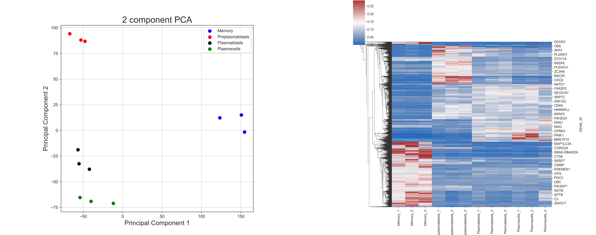
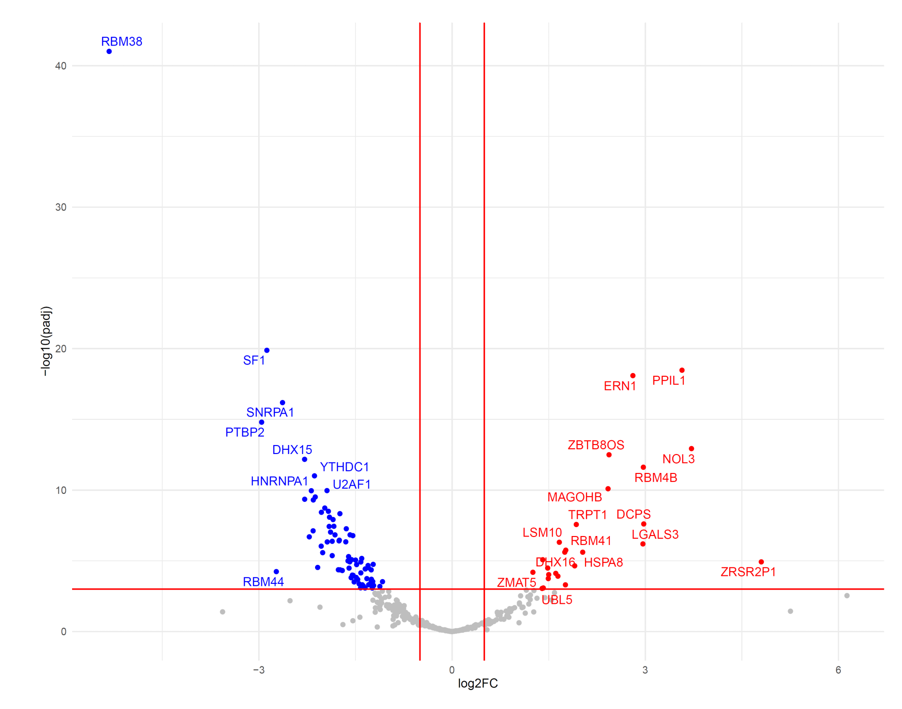
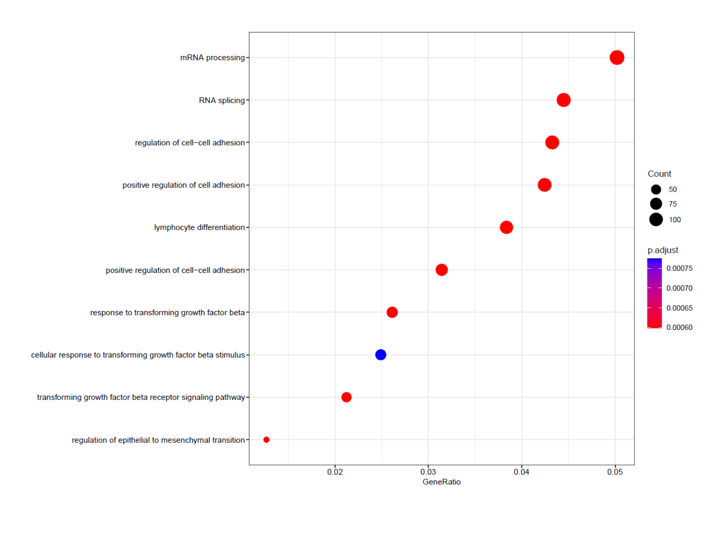

# Project Overview

During my doctoral studies, my colleague and I studied the complex network that governs how cells transport and release proteins, a crucial aspect of their function.

For immune cells, especially lymphocytes, this process becomes pivotal during their activation and differentiation phases. As these cells become activated, they enter a state where they produce and release significant amounts of substances such as cytokines, cytotoxins, or antibodies. Understanding how these cells efficiently and specifically manage this process of transporting and releasing substances is essential.

Our initial step was to analyze differences in gene expression levels across various stages of B-lymphocyte activation and differentiation. This analysis revealed distinct patterns of gene expression specific to each cell type, providing valuable insights into the regulatory strategies adopted by B-lymphocytes at different stages to modulate their secretory functions.

We applied techniques outlined in the table of contents, and this repository includes code examples that generated Figures 1 (B-D) and 2 (A-F) presented in the [publication](https://www.frontiersin.org/articles/10.3389/fimmu.2022.1030409/full).

## Table of Contents
1. [RNA-seq Data Analysis](#1-rna-seq-data-analysis)
2. [Data Analysis and Visualization](#2-data-analysis-and-visualization)
   - [Installation](#installation)
3. [Citations](#citations)

## 1. RNA-seq Data Analysis

We conducted an analysis on publicly available RNA-seq data related to B cell differentiation, sourced from [GSE148924](https://www.ncbi.nlm.nih.gov/geo/query/acc.cgi?acc=GSE148924). For a more detailed version of the methods employed, please refer to the [complete publication](https://www.frontiersin.org/articles/10.3389/fimmu.2022.1030409/full).

## 2. Data Analysis and Visualization

The data analysis was executed using Python 3.7.11 and R v. 4.2.1. Ensure you have the required libraries installed before running the code examples.

### Python Libraries

#### Requirements

- Python 3.7.11 (or above)
- Jupyter Notebook (optional, for running `GE_analysis.ipynb`)

#### Installation

```bash
pip install pandas==1.3.3 numpy==1.21.2 seaborn==0.11.2 matplotlib==3.4.3 scikit-learn==0.24.2
```

#### Figure Example

In the left figure, we employed principal component analysis (PCA) to examine the expression pattern of 15,754 genes. Our analysis revealed distinct separation among B cells at various stages, with samples from each cell type forming closely-clustered groups. On the right figure, the Heatmap illustrates genes with different expression levels within B cells. The code described in [`GE_analysis.ipynb`](GE_analysis.ipynb) demonstrates how we generated these figures. 



### R Libraries

#### Requirements

- R v. 4.2.1
- RStudio (optional, for running R scripts interactively)

#### Volcano Plot

#### Installation

```R
install.packages(c("tidyverse", "readxl", "ggrepel", "dplyr", "EnhancedVolcano", "ggplot2", "cowplot"))
```
#### Figure Example

In this figure, we explored how genes related to RNA-based mechanisms are differently expressed between two stages of B cells. The code described in [`VolcanoPlot_example.R`](VolcanoPlot_example.R) demonstrates how we generated this figure. 



#### Gene Ontology (GO) Term Enrichment Analysis

#### Installation

```R
install.packages(c("tidyverse", "readxl", "ggrepel", "dplyr", "clusterProfiler", "org.Hs.eg.db", "AnnotationDbi", "ggplot2", "cowplot"))
```
#### Figure Example

In this figure, we explored the 10 strongest enriched GO terms between two different stages of B cells. The code described in [`GOterm_example.R`](GOterm_example.R) demonstrates how we generated this insightful figure. 


---

## Citation
```
Ostwaldt F., Los B., Heyd F. In silico analysis of alternative splicing events implicated in intracellular trafficking during B-lymphocyte differentiation. Front Immunol. 2022 Nov 10:13:1030409. doi: 10.3389/fimmu.2022.1030409. eCollection 2022.

